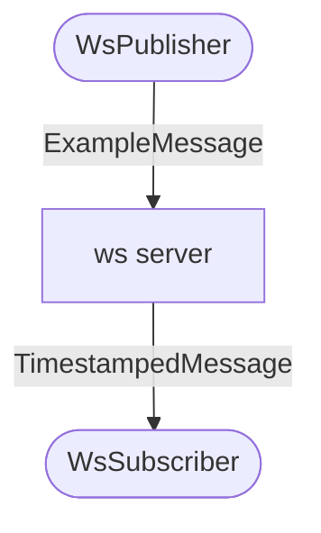

# java-ws-stomp

Example repo for passing trace context across stomp proto on a websocket.
This example uses Spring Boot for most components.

The full source code for this walkthrough is available 
[here](https://github.com/breedx-splk/java-ws-stomp).

# introduction

Tracing in distributed systems can be challenging, and often moreso
when messaging systems are involved. To stitch together a comprehensive trace,
the [trace context](https://opentelemetry.io/docs/instrumentation/js/context/)
must be propagated between observed components. In HTTP systems, this is relatively
straightforward, and the [W3C HTTP headers](https://www.w3.org/TR/trace-context/#trace-context-http-headers-format)
are readily propagated by OpenTelemetry instrumentation.

Messaging systems almost always have headers too, but, depending on the implementation, 
can be tricky to implement. This is further complicated by ability of many messaging
systems to support one-to-many or even many-to-one models. The OpenTelemetry community
has built a detailed set of specifications around messaging systems that you can 
[read here](https://github.com/open-telemetry/opentelemetry-specification/blob/main/specification/trace/semantic_conventions/messaging.md).
Not every type of messaging system has been covered yet by OpenTelemetry's
Java auto-instrumentation. 

Depending on the protocols in place, it could be even worse -- we could have 
the ability to use or see headers with each protocol frame, the envelope that
contains messages, and possibly within the message itself! Yikes.

When autoinstrumentation is not sufficient or has not yet been built, 
we can almost always resort to building manual instrumention to help out.

In this session, we will walk through a sample messaging project that does 
not have comprehensive autoinstrumentation. We will roll up our sleeves and 
implement manual tracing and context propagation that stitches together 
pub/sub components into a single trace.

# topology

We recently had a user who was running into difficulty with 
websocket instrumentation. In their use case, they are using the 
[STOMP](https://stomp.github.io/) protocol over the websocket 
with the [Spring project](https://spring.io/)'s websocket and messaging 
support. In this configuration, they are able to build a pub/sub 
messaging framework.

The server exposes a websocket. The publisher connects to this websocket
in order to send messages, and a subscriber connects to the same websocket
in order to receive messages. A small Spring Controller helps convert the type
of the message and route to another destination.

It looks something like this:



1. The `WsPublisher` connects to the websocket and publishes/sends
JSON messages in [STOMP](https://stomp.github.io/) format to `/app/tube`.
2. The `WsServerController` contains a message mapping that converts 
`ExampleMessages` into `TimestampedMessages` and sends these to `/topic/messages`.
This acts as our "business" layer, that you could imagine contains much more sophisticed
message transformation. 
3. The `WsSubscriber` also connects to the ws and creates a subscription
to `/topic/messages`. When it receives a message, it logs the content.

For demo simplicity, we have kept this as a single monolithic java process, but there
is nothing in this concept that mandates that. In a real-world deployment, you would
expect the 3 components to be deployed as separate processes on separate hosts
or containers.

# out of the box

Out of the box, this configuration yields pretty uninteresting, broken, unlinked traces.
In fact, for a 10 minute run that pub/subbed 300+ messages, we only see 3 traces:


The first two look oddly similar:


These are being generated by the `spring-webmvc` instrumentation when the publisher and the subscriber perform their
initial connection to `UPGRADE` the plain HTTP connection to a websocket. That's informative, but not super 
helpful for long runs and don't give any information about our messaging component.

The third trace is being generated by the `spring-scheduling` instrumentation, presumably to handle
some websocket or messaging/routing internals:


All of these separate traces, none of them linked. We can make this better!

# adding manual instrumentation

Let's add some manual OpenTelemetry instrumentation to our project in order
to pass trace context to our components and to improve our observability story.
We start by adding these two OTel dependencies to our `build.gradle.kts` file:

```kotlin
dependencies {
    implementation("io.opentelemetry:opentelemetry-sdk:1.21.0")
    implementation("io.opentelemetry.instrumentation:opentelemetry-instrumentation-annotations:1.22.1")
    ...
}
```

## Publisher

We'll start with the publisher. Our scheduled job invokes `WsPublisher.sendOne()` every 2 seconds. We'll begin
by adding the OpenTelemetry `@WithSpan` annotation to this method:

```java
@WithSpan(value="/app/tube publish", kind = SpanKind.PRODUCER)
private void sendOne() {
  ...
}
```

This annotation tells OpenTelemetry to create a new span every time the `sendOne()` method is invoked.
In keeping with [the specification](https://github.com/open-telemetry/opentelemetry-specification/blob/main/specification/trace/semantic_conventions/messaging.md), 
we indicate that the span should be a `PRODUCER`. Because this is the start of our pub/sub process,
there is no parent and this will be our root span in the trace.

The component downstream from us needs to know our trace context, which includes our trace ID + span
ID parentage. Right now, however, our context is not propagated into the STOMP data frames 
and we need to write a little code.

To do this, we make a new instance of `StompHeaders` and set our message destination.

```java
StompHeaders headers = new StompHeaders();
headers.setDestination("/app/tube");
```

We then leverage the OpenTelemetry API to set our current trace context into the 
context propagation mechanism, which is implemented with the TextMapPropagator.

```java
GlobalOpenTelemetry.getPropagators()
    .getTextMapPropagator()
    .inject(Context.current(), headers, (carrier, key, value) -> {
        if(carrier != null){
            carrier.set(key, value);
        }
    });
```

What's cool about this approach is that, as a user, we are don't have to know the 
inner workings of the propagation mechanism. For example, we don't ever have to reference
the name of the context header or the format of the data inside the propagation value! Our
lambda just serves as a litte type adapter for the specific implementation.

That's it for the publisher. Now we'll move on to the server side router.

## Server/Router

Our routing method on the server side is `WsServerController.routeTube()`, and it is annotated
with Spring's `@MessageMapping`. From [the documentation](https://docs.spring.io/spring-framework/docs/current/reference/html/web.html#supported-method-arguments) we have learned
that we can add a `SimpMessageHeaderAccessor` parameter to our method so that we can 
access the headers present on the incoming message. So our signature looks like this:

```java
@MessageMapping("/tube")
public void routeTube(ExampleMessage exampleMessage, SimpMessageHeaderAccessor headerAccessor) {
    ...
}
```

In order to put ourselves into the correct trace context, we consult
[the upstream otel documentation](https://opentelemetry.io/docs/instrumentation/java/manual/#context-propagation) 
and learn that we should implement an interface that lets us get a header value from 
our `SimpleMessageHeaderAccessor`. For simplicity we build it as an inner class:

```java
static class HeadersAdapter implements TextMapGetter<SimpMessageHeaderAccessor> {
    @Override
    public String get(@Nullable SimpMessageHeaderAccessor carrier, String key) {
        return carrier.getFirstNativeHeader(key);
    }

    @Override
    public Iterable<String> keys(SimpMessageHeaderAccessor carrier) {
        return carrier.toMap().keySet();
    }
}
```

Now that we have this `TextMapGetter` impl, we can extract the incoming trace context from OpenTelemetry:

```java
var traceContext = GlobalOpenTelemetry.getPropagators()
                     .getTextMapPropagator()
                     .extract(Context.current(), headerAccessor, new HeadersAdapter());
```

But what do we do with it? Well, we make it "current", of course, using a java autocloseable `try` block:

```java
try (var scope = traceContext.makeCurrent()) {
  ...
}
```

Now that we're parented in the existing scope, we want to create a new span that represents
our routing action. You'll frequently encounter this common pattern when doing manual instrumenation
like this:

* get a tracer
* create a `SpanBuilder`
* start the span
* make the new span the current scope
* (do business logic)
* end the span

Which in this case looks like this:

```java
var serverSpan = tracer.spanBuilder("MessageMapping /tube")
                .setSpanKind(SpanKind.SERVER)
                .startSpan();
try(Scope x = serverSpan.makeCurrent()){
    doRoute(exampleMessage, headerAccessor);
}
finally {
    serverSpan.end();
}
```

I chose `SERVER` here, but I'm not 100% sure that's right and maybe there's a case to be made for `CONSUMER`.
    
Down in `doRoute()` you should notice the same basic header injection method 
that we used for the publisher:
```java
var headers = new HashMap<>(msgHeaders.toMap());
GlobalOpenTelemetry.getPropagators()
    .getTextMapPropagator()
    .inject(Context.current(), headers, (carrier, key, value) -> {
        if(carrier != null){
            carrier.put(key, value);
        }
    });
```
    
That's all for the server routing side. A new trace will be created, and our 
context will be put into the routed message headers. 

## Subscriber
    
The subscriber is the last piece of our puzzle, and the business method is `WsSubscriber.handleFrame()`, and 
this method receives the `StopHeaders` and the payload message object instance. 
    
Just like we did with the router, we extract the incoming trace context from OpenTelemetry. Rather than create an 
inner class, this time we used an anonymous class and hid this away in a method:
    
```java
private static Context getTraceContext(StompHeaders headers) {
return GlobalOpenTelemetry.getPropagators().getTextMapPropagator()
        .extract(Context.current(), headers, new TextMapGetter<>() {
            @Nullable
            @Override
            public String get(@Nullable StompHeaders carrier, String key) {
                return carrier.getFirst(key);
            }

            @Override
            public Iterable<String> keys(StompHeaders carrier) {
                return headers.toSingleValueMap().keySet();
            }
        });
}
```
    
And just like before, we call this in order to "makeCurrent()" that context, then within
that context we create our new `CONSUMER` span:
    
```java

var traceContext = getTraceContext(headers);
try (var scope = traceContext.makeCurrent()) {
    TimestampedMessage msg = (TimestampedMessage) payload;
    var tracer = GlobalOpenTelemetry.getTracer("Custom_MessageSubscriber");
    var span = tracer.spanBuilder("/topic/messages receive")
            .setSpanKind(SpanKind.CONSUMER)
            .setAttribute("x-from", msg.getFrom())
            .setAttribute("x-subject", msg.getSubject())
            .startSpan();
    try(var x = span.makeCurrent()) {
        <message handling business logic goes here>
    }
    finally{
        span.end();
    }
}
```

It's worth noting that the message `from` and `subject` fields are appended to 
the `CONSUMER` span in the form of custom attributes.
    
# improved traces


    
# improvements
    
This exercise was intended to show how manual instrumentation could be used to 
stitch together messaging components via trace context propagation. It should not be considered
complete, and there are several noteworthy shortcomings:
    
* `messaging.system` and `messaging.operation` required attributes are missing
* 

# appendix

* [related discussion](https://github.com/open-telemetry/opentelemetry-java/discussions/3345)
* [relevant spring websocket tutorial](https://www.baeldung.com/websockets-spring)
* [relvant spring websocket client tutorial](https://www.baeldung.com/websockets-api-java-spring-client)
* heavily utilized the upstream otel java documentation around [manual context propagation](https://opentelemetry.io/docs/instrumentation/java/manual/#context-propagation)
